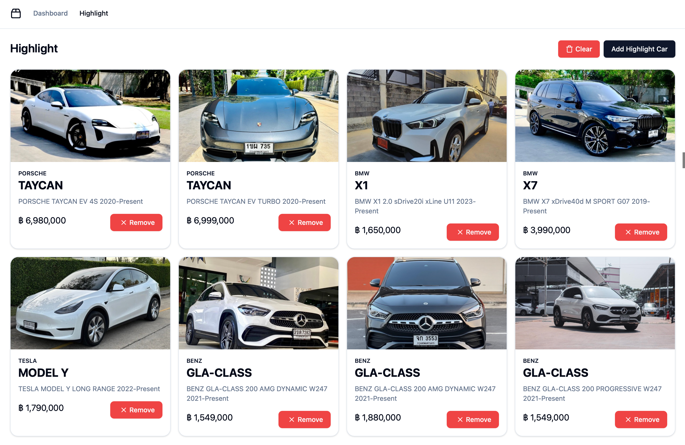

# PROJECT 01 - Car Analytics

- Score: 10%
- Due Date: Sunday 25 August 2024

## Instructions

- Build a web app
- Use React.js with React Routing
- Use Local Storage for persistence
- No backend - data is from the provided JSON file

## Submission

- Deploy on GitHub page
- GitHub repo URL
  - with well-formated frontpage (README.md)
  - with screen shots

## Extra Things you need to do

1. Learn chart.js

## App Specification

1. The app is only for the market owner (not buyers or sellers)
    - No login screen is required.

2. List of cars is in JSON file.

3. You can use any component libraries, those were not covered in class.

4. The app has at least 2 pages.

    - a. Dashboard page

    - b. Highlighted Car page

5. The first page of the app is the dashboard.

6. Dashboard page

    a. showing the following query results

    - i. A table showing Number of cars and values (in Baht) by brands and models
  eg.
  Honda = 100
  --> Honda / Accord = 20
  --> Honda / Civic = 30
  --> Honda / City = 50
  Toyota = 200
  --> Toyota / Camry = 100
  …etc

    - ii. A Pie Chart showing portion of cars by brand.

    - iii. A Stacked bar chart showing models of a brand in a bar.

7. Highlighted cars page

    - a. The page shows highlighted cars

    - b. Select cars to be shown on the page.

    - c. Remove cars from highlight page

    - d. On reload, the highlighted items persists.


## Usage

To install the project, run the following command:
```bash
npm install
```

To run the project, run the following command:
```bash
npm run dev 
```

To build the project, run the following command:
```bash
npm run build
```

## Screenshots




## Team Members

- Panuphong Burakitphachai 6410521
- Phawat Tanajiranon 6413056
- Nitipoom Aumpitak 6420061
